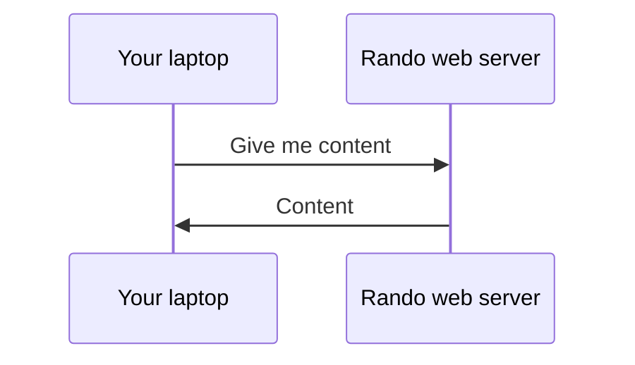

---
layout: cover
---

# Games

10.15am - 11.00am

<style>
h1 {
  background-color: orange;
  background-image: linear-gradient(45deg, orange 10%, orangered 50%);
  background-size: 100%;
  background-clip: text;
  -webkit-background-clip: text;
  -moz-background-clip: text;
  -webkit-text-fill-color: transparent;
  -moz-text-fill-color: transparent;
}
</style>

---
layout: cover
---

# HTML, CSS, JS

11.00am - 12.15pm

<style>
h1 {
  background-color: orange;
  background-image: linear-gradient(45deg, orange 10%, orangered 50%);
  background-size: 100%;
  background-clip: text;
  -webkit-background-clip: text;
  -moz-background-clip: text;
  -webkit-text-fill-color: transparent;
  -moz-text-fill-color: transparent;
}
</style>

---
layout: two-cols
---

# How does the web work?

HTTP: HyperText Transfer Protocol [^1]

<v-click>

Sending data (files) over the internet

</v-click>

<v-click>

Request --> Response

</v-click>

::right::

<div v-click class="flex h-full items-center">



</div>

[^1]: [Learn more](https://developer.mozilla.org/en-US/docs/Web/HTTP/Overview)

---

# HTTP status codes

<v-clicks>

* Indicates type of response
* Number ranging from 100 - 599
* Each range represents a different type of response!

</v-clicks>

<v-click>

| Range     | Type                  | Common examples           |
| --------- | --------------------- | ------------------------- |
| 100 - 199 | Information responses | 101 Switching Protocol    |
| 200 - 299 | Successful responses  | 200 OK                    |
| 300 - 399 | Redirection messages  | 302 Moved Permanently     |
| 400 - 499 | Client errors         | 400 Bad Request           |
| 500 - 599 | Server errors         | 503 Internal Server Error |

</v-click>

---
layout: two-cols
---

# HTML, CSS, JS

* HTML: Hypertext Markup Language
  * Provides the content of your webpage

* CSS: Cascading Style Sheets
  * Provides styling of your webpage

* JS: Javascript
  * Provides the functionality of your webpage

::right::

<div flex="~ col" class="h-full justify-center">
  <div class="flex justify-between">
    
    
  </div>
  
</div>

---

# Structure of HTML

<div class="flex flex-row-reverse">
<div class="flex flex-1 items-center">

```html {all|1|2,10}
<!DOCTYPE html>
<html lang="en">
  <head>
    <script></script>
    <style></style>
  </head>
  <body>
    <h1>HELLO!</h1>
  </body>
</html>
```

</div>
<div class="flex-1">

<div v-click="1">
<div v-click-hide="2">

* Tell browser that this file is HTML

</div>
<div v-click="2">
<div v-click-hide="3">

* Start of `html`

</div>
</div>
</div>
</div>
</div>


---
layout: two-cols
---

# HTML tags

* Specify what kind of elements are shown
* Many types of elements you can choose from [^1]
  * Headings
  * Buttons
  * Input fields
  * Cat 🙀

::right::


<div class="flex flex-col h-full justify-center">

##### Headings

<RunnerWebsite code="<h1>hello</h1><h2>Smaller hello</h2>">

```html {all|1,3|4,6|all}
<h1>
  hello
</h1>
<h2>
  Smaller hello
</h2>
```

</RunnerWebsite>

<br/>

##### Buttons

<RunnerWebsite code="<button>BUTTOTOOTTN</button>">

```html {all|1,3}
<button>
  BUTTOTOOTTN
</button>
```

</RunnerWebsite>
</div>

[^1]: [List of HTML tags](https://www.w3schools.com/TAGs/)

---
layout: two-cols
---

<div class="flex flex-col items-between">

# HTML attributes

* Customize elements [^1]
  * `style`
  * `type`
  * etc

<br />

##### Inputs

<RunnerWebsite code='<div style="padding: 0.3em;"><input type="submit"/><br/><input type="date"/><br/><input type="checkbox"/></div>'>

```html {all|2,4,6|all}
<input 
  type="submit" />
<input 
  type="datetime" />
<input 
  type="checkbox" />
```

</RunnerWebsite>
</div>

::right::

<div class="flex flex-col h-full ml-5 justify-center">

##### Headings

<RunnerWebsite code='<h1 style="color: red;">hello</h1><h2 style="color: blue;">Smaller hello</h2>'>

```html {all|2,6|all}
<h1 
  style="color: red;">
  hello
</h1>
<h2 
  style="color: blue;">
  Smaller hello
</h2>
```

</RunnerWebsite>

<br/>

##### Buttons

<RunnerWebsite code='<button style="background: red;">BUTTOTOOTTN</button>'>

```html {all|2|all}
<button 
  style="background: red;">
  BUTTOTOOTTN
</button>
```

</RunnerWebsite>
</div>

[^1]: [More about attributes](https://www.w3schools.com/htmL/html_attributes.asp)


---

# CSS

* Style elements and make them look ✨ fancy ✨💄💁
* We've already used CSS in the `style` attribute previously

---

# Installation

* NodeJS
* NPM
* Firebase CLI

---

# Installation

Install NodeJS and NPM from [here](https://docs.volta.sh/guide/getting-started#windows-installation)

---

# Installation

