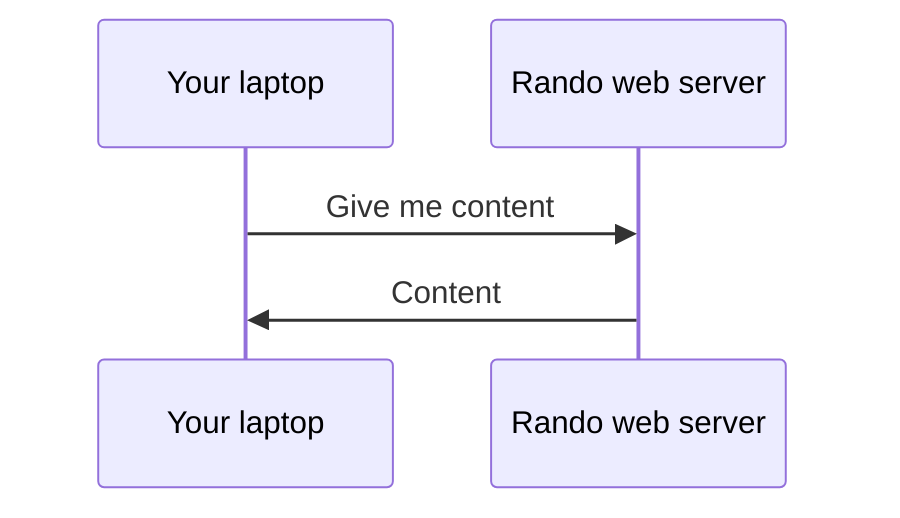
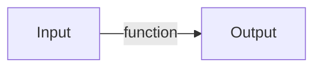

---
layout: cover
---

# Games

10.15am - 11.00am

<style>
h1 {
  background-color: orange;
  background-image: linear-gradient(45deg, orange 10%, orangered 50%);
  background-size: 100%;
  background-clip: text;
  -webkit-background-clip: text;
  -moz-background-clip: text;
  -webkit-text-fill-color: transparent;
  -moz-text-fill-color: transparent;
}
</style>

---
layout: cover
---

# HTML, CSS, JS

11.00am - 12.15pm

<style>
h1 {
  background-color: orange;
  background-image: linear-gradient(45deg, orange 10%, orangered 50%);
  background-size: 100%;
  background-clip: text;
  -webkit-background-clip: text;
  -moz-background-clip: text;
  -webkit-text-fill-color: transparent;
  -moz-text-fill-color: transparent;
}
</style>

---
layout: two-cols
---

# How does the web work?

HTTP: HyperText Transfer Protocol [^1]

<v-click>

Sending data (files) over the internet

</v-click>

<v-click>

Request --> Response

</v-click>

::right::

<div v-click class="flex h-full items-center">



</div>

[^1]: [Learn more](https://developer.mozilla.org/en-US/docs/Web/HTTP/Overview)

---

# HTTP status codes

<v-clicks>

* Indicates type of response
* Number ranging from 100 - 599
* Each range represents a different type of response!

</v-clicks>

<v-click>

| Range     | Type                  | Common examples           |
| --------- | --------------------- | ------------------------- |
| 100 - 199 | Information responses | 101 Switching Protocol    |
| 200 - 299 | Successful responses  | 200 OK                    |
| 300 - 399 | Redirection messages  | 302 Moved Permanently     |
| 400 - 499 | Client errors         | 400 Bad Request           |
| 500 - 599 | Server errors         | 503 Internal Server Error |

</v-click>

---
layout: two-cols
---

# HTML, CSS, JS

* HTML: Hypertext Markup Language
  * Provides the content of your webpage

* CSS: Cascading Style Sheets
  * Provides styling of your webpage

* JS: Javascript
  * Provides the functionality of your webpage

::right::

<div flex="~ col" class="h-full justify-center">
  <div class="flex justify-between">
    
    
  </div>
  
</div>

---
layout: two-cols
---

# HTML tags

* Specify what kind of elements are shown
* Many types of elements you can choose from [^1]
  * Headings
  * Buttons
  * Input fields
  * Cat 🙀

::right::


<div class="flex flex-col h-full justify-center">

##### Headings

<RunnerWebsite code="<h1>hello</h1><h2>Smaller hello</h2>">

```html {all|1,3|4,6|all}
<h1>
  hello
</h1>
<h2>
  Smaller hello
</h2>
```

</RunnerWebsite>

<br/>

##### Buttons

<RunnerWebsite code="<button>BUTTOTOOTTN</button>">

```html {all|1,3}
<button>
  BUTTOTOOTTN
</button>
```

</RunnerWebsite>
</div>

[^1]: [List of HTML tags](https://www.w3schools.com/TAGs/)

---
layout: two-cols
---

<div class="flex flex-col items-between">

# HTML attributes

* Customize elements [^1]
  * `style`
  * `type`
  * etc

<br />

##### Inputs

<RunnerWebsite code='<div style="padding: 0.3em;"><input type="submit"/><br/><input type="date"/><br/><input type="checkbox"/></div>'>

```html {all|2,4,6|all}
<input 
  type="submit" />
<input 
  type="datetime" />
<input 
  type="checkbox" />
```

</RunnerWebsite>
</div>

::right::

<div class="flex flex-col h-full ml-5 justify-center">

##### Headings

<RunnerWebsite code='<h1 style="color: red;">hello</h1><h2 style="color: blue;">Smaller hello</h2>'>

```html {all|2,6|all}
<h1 
  style="color: red;">
  hello
</h1>
<h2 
  style="color: blue;">
  Smaller hello
</h2>
```

</RunnerWebsite>

<br/>

##### Buttons

<RunnerWebsite code='<button style="background: red;">BUTTOTOOTTN</button>'>

```html {all|2|all}
<button 
  style="background: red;">
  BUTTOTOOTTN
</button>
```

</RunnerWebsite>
</div>

[^1]: [More about attributes](https://www.w3schools.com/htmL/html_attributes.asp)


---

# CSS

* Style elements and make them look ✨ fancy ✨💄💁 [^1]

* We've already used CSS in the `style` attribute previously

[^1]: [More about CSS](https://developer.mozilla.org/en-US/docs/Web/CSS)

<!-- TODO: More elaboration? Not sure hmm -->

---
layout: center
---

# 5 minutes break

---
layout: two-cols
---

# Javascript

* Actually called ECMAScript
* High level language

*** 

* Used on servers and browsers
* Very speed 🚄

---

# Functions

* Blocks of code that does something
* Like mathematical functions, it has 
  * **Input** (parameters/arguments) 
  * **Output** (return value)



```javascript
function <name>(<arguments>) {
  return <return value>
}
```

---

# Functions

<Runner code="console.log(3)">

```javascript
function add(x, y) {
  return x + y
}

add(1, 2)
```

</Runner>

<br/>

<Runner code="console.log(1)">

```javascript
function minus(x, y) {
  return x - y
}

add(5, 4)
```

</Runner>

---

# Showing output

* Show output/print using `console`
* Multiple logging levels
  * `log`
  * `warn`
  * `error`

<Runner code="console.log('This will show in the console!'); console.warn('I like orange'); console.error('This will be red')">

```javascript
console.log('This will show in the console!')
console.warn('I like orange')
console.error('This will be red')
```

</Runner>

---

# Variables

* Data is stored in variables
* There are three ways to declare variables [^1]

`(var|let|const) <name of variable> = <value>`

| Keyword | Explanation                            | Should I use this?     |
| ------- | -------------------------------------- | ---------------------- |
| `var`   | Creates a variable in a function scope | Avoid unless necessary |
| `let`   | Creates a variable in the block scope  | ✅                      |
| `const` | Creates a constant variable            | ✅                      |

[^1]: [Variable declarations](https://developer.mozilla.org/en-US/docs/Learn/JavaScript/First_steps/Variables#a_note_about_var)

<!-- There are key differences between `var` and `const`, but we will not go through them all today. Let's just go through the key differences -->

---

# Variables

##### `var`

Available before declaration as `undefined`

<Runner code="console.log(undefined); console.log('I am everywhere!')">

```javascript
console.log(everywhere)
var everywhere = 'I am everywhere!'
console.log(everywhere)
```

</Runner>


---

# Variables 

##### `let`

Not available before declaration

<Runner code="console.error(`Uncaught ReferenceError: Cannot access 'everywhere' before initialization`)">

```javascript
console.log(everywhere)
let everywhere = 'I am everywhere!'
console.log(everywhere)
```

</Runner>

But this works!

<Runner code="console.log(`I am everywhere!`)">

```javascript
let everywhere = 'I am everywhere!'
console.log(everywhere)
```

</Runner>


---

# Variables

##### `const`

Used for variables that **shouldn't be updated**

<Runner code="console.log('T0411111B')">

```javascript
const MY_NRIC = 'T0411111B'
console.log(everywhere)
```

</Runner>

---

# Types of variables

We used one type of variable just now, a `String`. but there are others!

* Different types can store different variations of data, to make your life easier

| Type      | Usage               |
| --------- | ------------------- |
| `String`  | Used for text       |
| `Number`  | Used for numbers    |
| `Boolean` | Used for true/false |
| `Object`  | Used for objects    |
| `Array`   | Used for arrays     |

---

# Objects

* A key-value pair
* Declare using curly braces 
  * `{` and `}`

```javascript
const jimmy = {
  name: 'Jimmy',
  age: 21,
  isCool: true,
  friends: ['John', 'Jane', 'Jim'],
}

```

To access the values in the object use the dot notation, or the bracket notation

<Runner code="console.log('Jimmy'); console.log(21);">

```javascript
console.log(jimmy.name) // Dot notation
console.log(jimmy['age']) // Bracket notation
```

</Runner>

---

# Array

* A list of values
* Declare using square brackets
  * `[` and `]`

Jimmy has many friends, we want to store the names of his friends, so we use an `Array`

```javascript
const friends = ['John', 'Jane', 'Jim']
```

<v-click>

To access the values in the array, we have to get the *index* of the item

An *index* refers to the position of the item in the array. 

Indexes start from 0.

<Runner code="console.log('Jane')">

```javascript
console.log(friends[1]))
```

</Runner>
</v-click>

---

# Control flow

* Customize the behavior of your program based on a condition
* There are three keywords to do this
  * `if`
  * `else`
  * `else if`

```javascript
if (<condition 1>) {
  // Code to execute if condition 1 is true
} 
else if (<condition 2>) { 
  // Code to execute if condition 1 is false and condition 2 is true
}
else {
  // Code to execute if condition 1 and condition 2 are both false
}
```

---

# Comparators

* Sometimes we want to compare different values
  * For example, if variable `x` is greater than `y`

| Comparator | Explanation              | Usage    |
| ---------- | ------------------------ | -------- |
| `>`        | Greater than             | `x > y`  |
| `<`        | Less than                | `x < y`  |
| `>=`       | Greater than or equal to | `x >= y` |
| `<=`       | Less than or equal to    | `x <= y` |
| `==`       | Equal to                 | `x == y` |
| `!=`       | Not equal to             | `x != y` |

<style>
  code {
    font-family: monospace !important;
  }
</style>

---

# Advanced comparators

* Javascript is weird sometimes, so we have to use a little bit of extra code to make some stuff work

For example

<Runner code="console.log(2 == '2')">

```javascript
console.log(2 == "2")
```

</Runner>

But `2` is not equals to `"2"`! One is a `Number` and the other is a `String`

To enforce checking of types, we add one more `=`, like so: `===` and `!==`

<Runner code="console.log(2 === '2')">

```javascript
console.log(2 === "2")
```

</Runner>

<style>
  code {
    font-family: monospace !important;
  }
</style>

---

# Loops

Loops are used to do things that are repetitive, like printing out something `10` times

There are two ways:
* A `for` loop
* A `while` loop

`for (<initialization>; <condition>; <final expression>) {}`

<Runner code="for (let idx = 0; idx < 10; idx++) { console.log(idx) }">

```javascript
for (let idx = 0; idx < 10; idx++) {
  console.log(idx)
}
```

</Runner>

---

# Loops

##### `while`

This is the same code as a while loop

`while (<condition>) {}`

<Runner code="let idx = 0; while (idx < 10) { console.log(idx); idx++ }">

```javascript
let idx = 0
while (idx < 10) {
  console.log(idx)
  idx++
}
```

</Runner>

---

# Error handling

* Sometimes code gives us errors, and we need to handle them
  * For example, if we try to access a variable that doesn't exist

* To handle errors, we use a `try` block and a `catch` block
  * `try` is used to try something
  * `catch` is used to handle the error

---

# Error handling

Let's take the example from just now

<Runner code="console.error(`Uncaught ReferenceError: Cannot access 'everywhere' before initialization`)">

```javascript
console.log(everywhere)
let everywhere = 'I am everywhere!'
console.log(everywhere)
```

</Runner>

Catching the error:

<Runner code="console.error('There was an error, but I caught it!')">

```javascript
try {
  console.log(everywhere)
  let everywhere = 'I am everywhere!'
  console.log(everywhere)
} 
catch (error) {
  console.error('There was an error, but I caught it!')
}
```

</Runner>

---
layout: center
---

# 10 minutes break

---

# Concurrency

H e p l

---
src: ./html-structure.md
---

# Installation

* NodeJS
* NPM
* Firebase CLI

---

# NodeJS and NPM

1. Download the `exe` installer file
2. Run the installer
3. Run the following commands in Powershell (or Terminal if you're on macOS)

[Link to download](https://docs.volta.sh/guide/getting-started#windows-installation)

```bash
volta install node
volta install npm
volta install pnpm
```

---

#  Firebase CLI

1. To install, run the command

```bash
pnpm i -g firebase-tools
```

2. Then, you need to login to Firebase

```bash
firebase login
```

3. Test if it works

```bash
firebase projects:list
```

[Read more here](https://firebase.google.com/docs/cli#sign-in-test-cli)

