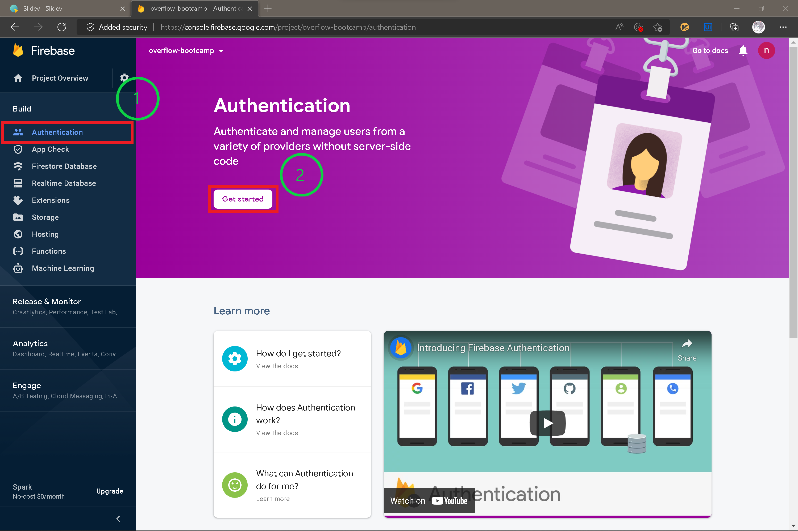
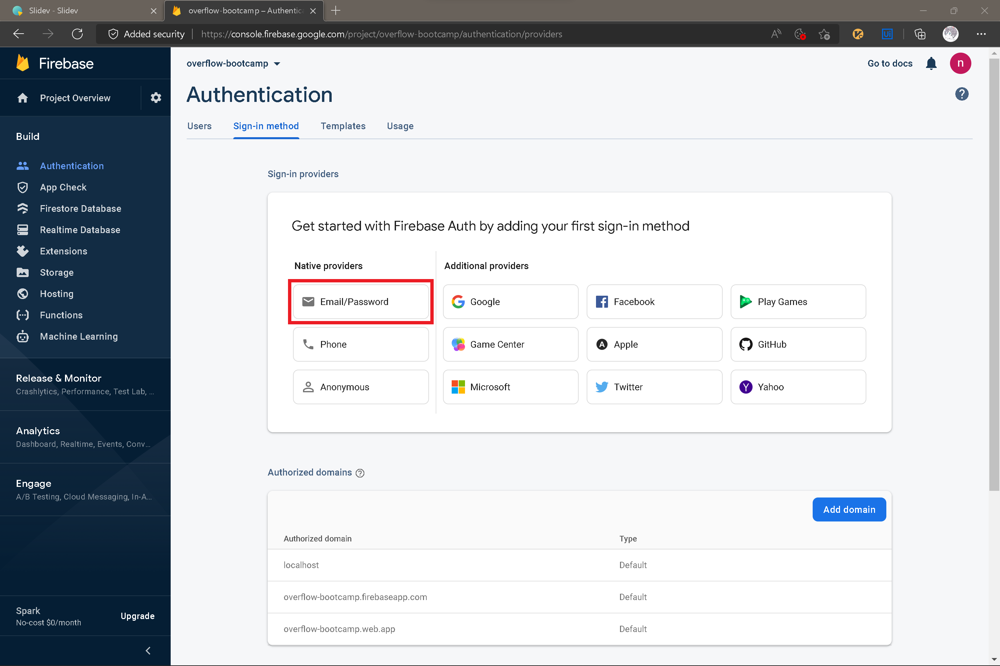
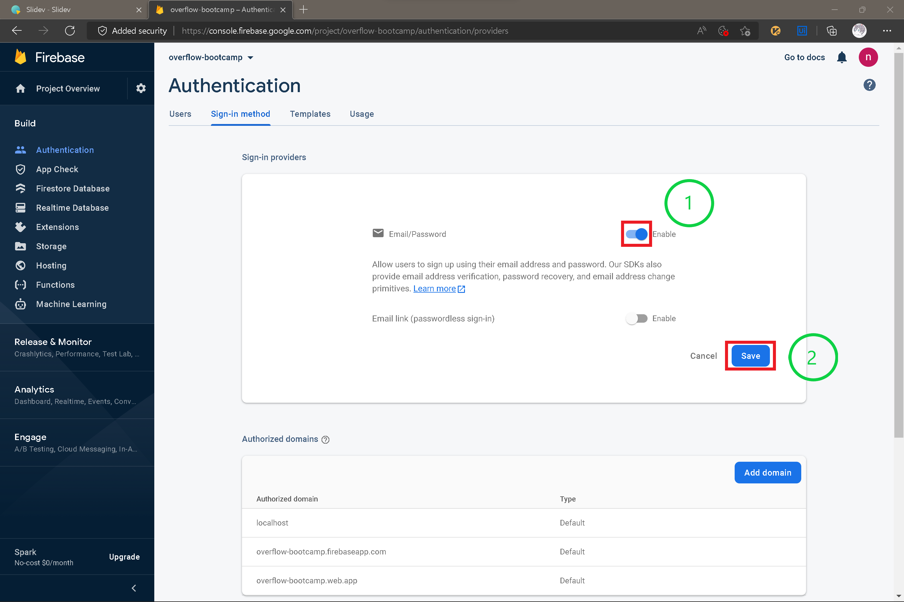
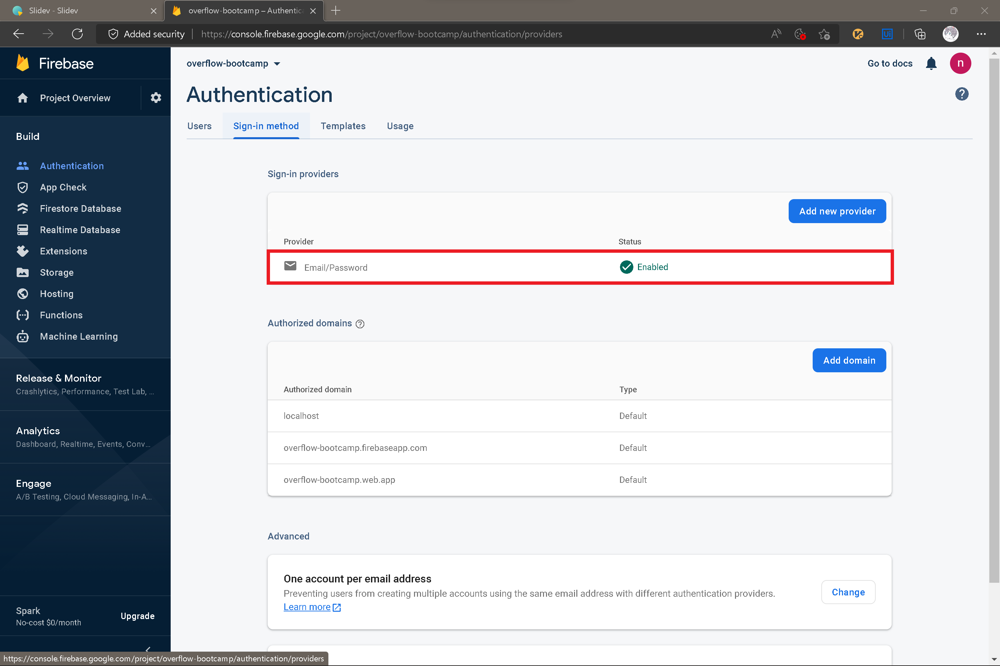

<h1>Enable Firebase Authentication</h1>

---
layout: center
---

<h1>Enable Firebase Authentication</h1>

---
layout: center
---

<h1>Enable Firebase Authentication</h1>

---
layout: center
---

<h1>Enable Firebase Authentication</h1>

