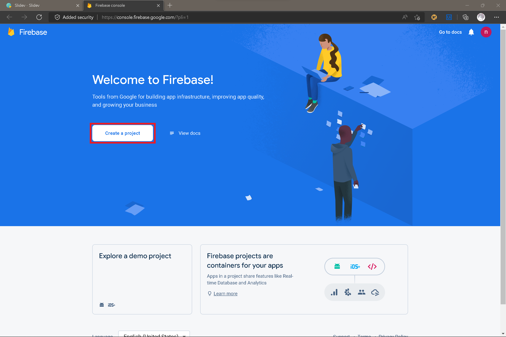
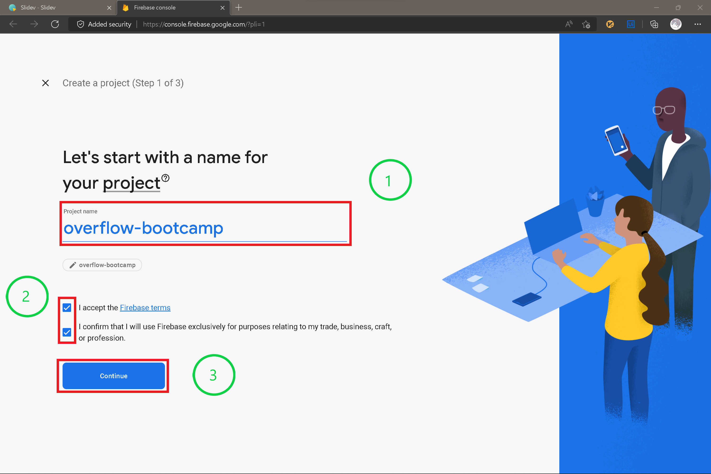
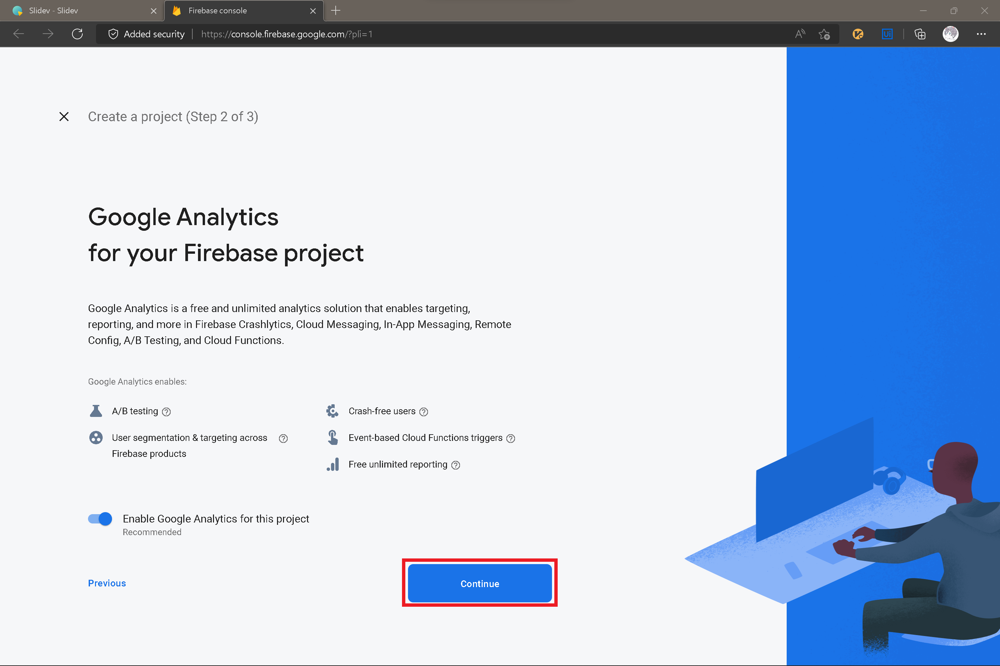
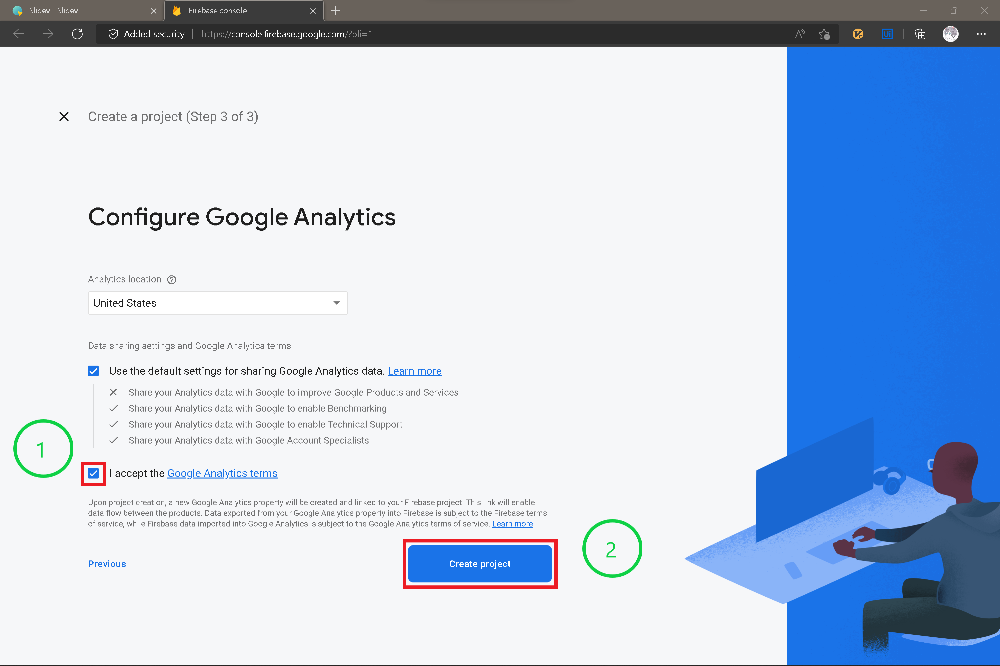
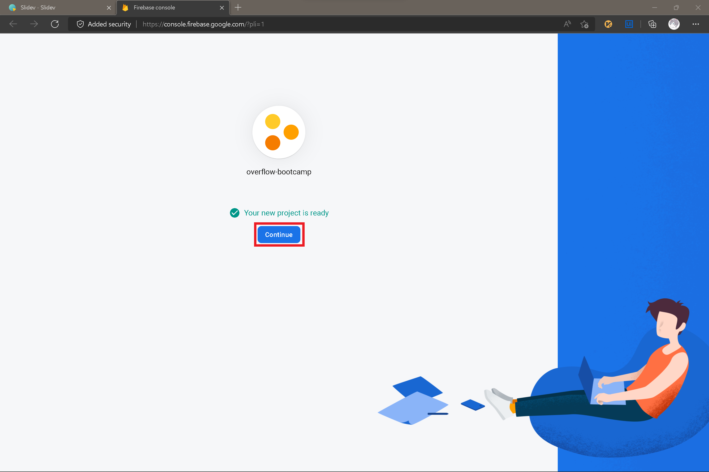

	<h1>Firebase</h1>
	

An overview of Firebase Authentication, Realtime Database

---
layout: center
---

<h1 style="text-align:center;">Firebase Console</h1>

	Please visit <a href="https://console.firebase.google.com" target="_blank"> Firebase Console</a> and login using your own <b>personal</b> Google Account   Don't use school email to login. School email doesn't have an access to Google Developers service

---
layout: center
---

<h1>Create Firebase Project</h1>

---
layout: center
---

<h1>Create Firebase Project</h1>

---
layout: center
---

<h1>Create Firebase Project</h1>

---
layout: center
---

<h1>Create Firebase Project</h1>

---
layout: center
---

<h1>Create Firebase Project</h1>

